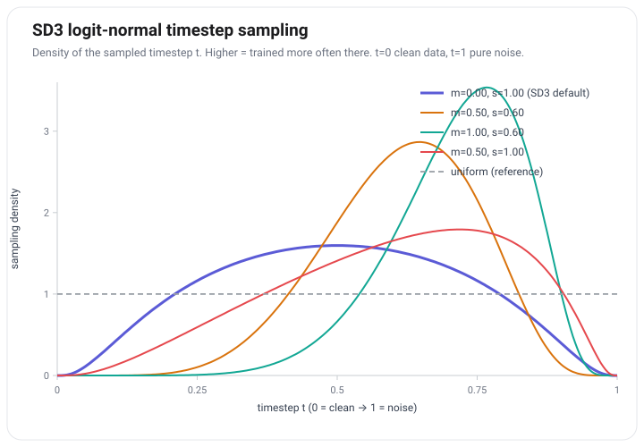
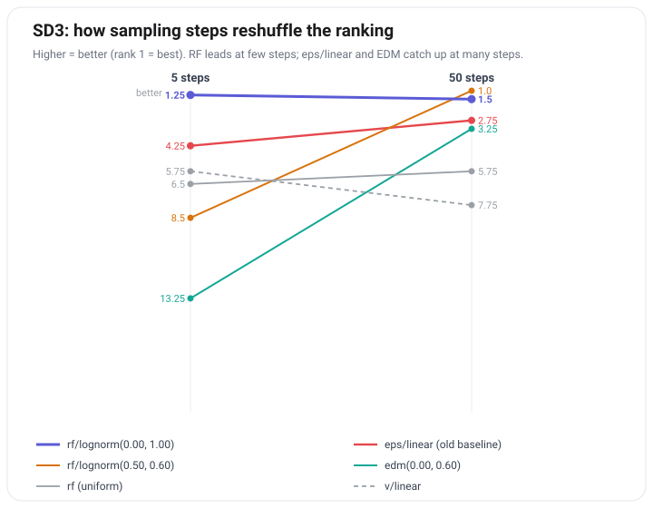

先抛一个我想了很久的问题：为什么"预测干净数据"能真正奏效？何恺明他们的 JiT 把功劳归给流形假设（manifold assumption），可我总觉得有点玄乎：听起来像事后贴的标签，不太像能被拆开检验的机制。

顺着这个痒点往下挖，我更想盯另一件事：监督信号的一对多（多义性），以及它如何变成局部回归与优化上的压力。JiT、v-预测、后来的 JLT，看上去各说各话，其实都在拧同一组旋钮：你让模型预测什么、在哪个空间里预测。拧这两个旋钮，等于在重分配"难学的压力"落在哪一段、落在哪些方向上。想通这一层，流形假设就不那么玄了。

## 真正要小心的：一对多的局部回归

生成任务的监督信号天生是多义的。给定一个几乎全是噪声的输入，能与之相容的干净图像有无穷多张。若把任务理解成"一步到位、用均方误差（MSE）直接回归干净图像"，最优解确实不是任何一张真实图，而是条件均值，也就是那张糊掉的"均值图"。这是一类真实的失败模式：单次确定性回归会把条件分布压成它的条件均值。

但立刻要划清边界。在 Flow Matching / 扩散里，训练目标学的常常是某个条件期望（速度、噪声或干净数据的条件均值）。在合适的正则条件下，这个条件期望场恰恰是把边缘分布从噪声端输运到数据端的正确对象；它不等于"最终样本塌成一张均值图"。随机初值、随状态变化的条件场，以及多步积分，才把完整分布搬过去。[Lipman et al., 2023](https://arxiv.org/abs/2210.02747) 一类工作讲的就是这条边缘输运故事。

所以后文说的"一对多压力"，主要指两层更窄的东西：局部预测在哪些 $t$、哪些方向上信息最少；以及有限容量网络在多义最狠处更容易学出糊的折中。它不是在说"Flow Matching 的数学目标本身会模式平均（mode averaging）"。后面那些技巧，很多都可以读成：把有限算力，尽量留在局部说得清、对优化也更友好的地方。

## 两个旋钮：预测目标，预测空间

这类压力并不是均匀摊开的。至少有两个旋钮：

1. **预测目标**：预测 $\varepsilon$、预测 $x_0$、还是预测 $v$。选哪一个，直接决定"局部最难学的那段 $t$"大致落在哪里。
2. **预测空间**：在原始像素里做，还是在压缩过的潜空间（latent）里做。空间一变，目标的协方差几何跟着变，哪些方向在输出坐标里被放大也就变了。

JiT 其实同时拧了两个旋钮（像素空间 + 直接预测 $x_0$），再用"流形假设"一句话打包。JLT 则把空间固定住，只拧目标这一个旋钮。所以读 JiT 时若只记住"流形"，会和"一对多"对不上话；把旋钮拆开，两者才是同一套语言。

先从旋钮 1 讲起。下文约定：$t=0$ 为干净端，$x_t=(1-t)x_0+t\varepsilon$，$v=\varepsilon-x_0$。（部分文献把 $t=0$ 当噪声，或把 $v$ 写成 $x-\varepsilon$，对比公式时先对齐约定。这里的 $v$ 是 data→noise 的正向速度；生成时通常反向积分。）Flow Matching 常用的速度预测（v-预测）里，给定 $x_t$ 知道了 $v$，就能反解出 $x_0$ 和 $\varepsilon$。预测 $v$，等于同时、隐式地确定噪声与图像：它不逼模型只押某一个极端，而是问一个更温和的问题：这一步该沿流挪多少。

## 难的不是两端，而是中间

很自然会问：从纯噪声到干净图像，哪一段最难学？我一开始也犯迷糊，中间图像和噪声各占一半，直觉上"两个都懂一点"，怎么看都不该是最难。但仔细想一下，恰恰相反。

关键在于：难度取决于你拧的是哪个预测目标。用一个最简单的线性高斯探针（联合高斯假设下的条件方差；非高斯时，下式只是线性最小均方误差的残差，协方差为零也不等于毫无信息）算一下"给定 $x_t$、目标的后验方差"，就能看得很清楚：

| 预测目标 | 探针下大致难区 |
|---|---|
| 噪声 $\varepsilon$ | 靠近干净端（高噪声端几乎白送） |
| 图像 $x_0$（JiT 一路） | 靠近噪声端（那里也最容易糊成均值图） |
| 速度 $v=\varepsilon-x_0$ | 中间反而最难（两端各白送一半） |

这就是旋钮 1 的直观含义：换预测目标，等于把局部难区从时间轴的一头搬到另一头，或搬到中间。这里的"难"先按探针里的不可约贝叶斯（Bayes）残差来读，它提示信息最少的地方在哪；不等于已经证明了有限网络的优化难度，更不等于最终样本质量的边际贡献。

v-预测为什么偏偏中间最难？$v$ 是一个"差"（$\varepsilon-x_0$），观测 $x_t$ 更像一个"和"（$(1-t)x_0+t\varepsilon$）。当噪声和信号各占一半时，这个"和"跟那个"差"几乎正交，也就是说 $x_t$ 对 $v$ 几乎不提供任何线性信息。所以"一半一半"不是"两个都懂一点"，而是"和把差抹掉了，两个都拎不清"。

## 一点小推导：后验方差与最难点 t\*

先把"难"怎么量说清楚。在这个高斯探针里，给定 $x_t$，预测 $v$ 的均方误差下界是后验方差 $\mathrm{Var}(v\mid x_t)$。它越大，这个 $t$ 处在探针意义下就越难学。（这里的"正交"指互协方差为零；对联合高斯，这才等价于独立。）

$$
\mathrm{Var}(v \mid x_t) = \underbrace{\mathrm{Var}(v)}_{\text{先验不确定}} - \underbrace{\frac{\mathrm{Cov}(v, x_t)^2}{\mathrm{Var}(x_t)}}_{\text{被 } x_t \text{ 解释掉的}} .
$$

于是最难的地方，恰恰是 $\mathrm{Cov}(v,x_t)=0$ 的地方：观测对目标一点线性信息都不给。设 $x_0$、$\varepsilon$ 相互独立、零均值，方差分别是 $\sigma_{x_0}^2$、$\sigma_\varepsilon^2$；目标 $v=\varepsilon-x_0$，观测 $x_t=(1-t)x_0+t\varepsilon$。协方差双线性摊开后，交叉项归零，剩下

$$
\mathrm{Cov}(v,\ x_t) = t\,\sigma_\varepsilon^2 - (1-t)\,\sigma_{x_0}^2 .
$$

这是一场拔河：$+t\varepsilon$ 跟 $v$ 里的 $+\varepsilon$ 同号，贡献正项；$+(1-t)x_0$ 跟 $v$ 里的 $-x_0$ 反号，贡献负项。干净端数据项占上风，噪声端噪声项占上风，中间必有一处两力抵消。令它为零：

$$
t^* = \frac{\sigma_{x_0}^2}{\sigma_{x_0}^2 + \sigma_\varepsilon^2}.
$$

在 $t^*$ 处后验方差顶到先验值，难度峰值锁死。当 $\sigma_{x_0}^2=\sigma_\varepsilon^2=1$ 时，$t^*=0.5$，且 $\mathrm{Var}(v\mid x_t)=2-\dfrac{(2t-1)^2}{(1-t)^2+t^2}$，两端等于 $1$、正中间等于 $2$。

对照之下，在同一探针里，$x_0$-预测的误差随噪声单调上升，$\varepsilon$-预测随噪声单调下降，唯独 v-预测把最难的点顶到内部。这大概也是 v-参数化讨人喜欢的原因之一；当然，"把难点挪到中间"本身并不自动等于更好，还要看采样、加权和容量怎么接住这座峰。

方差不相等呢？结论不塌："正好在中点"只是等方差特例，"最难点在内部"才是稳的（两边方差都严格为正时，$t^*$ 落在 $(0,1)$）。数据方差偏大，峰往噪声端挪一点，偏小就往干净端挪。实践里潜空间扩散常把 VAE latent 归一到接近单位方差；这首先服务于尺度、信噪比（SNR）和数值条件，副作用之一是让 $\sigma_{x_0}^2\approx\sigma_\varepsilon^2$，峰大致靠近中间。我不会反过来说：归一化就是为了校准本文的 $t^*$。

（选读）若再把数据协方差 $\Sigma$ 对角化，高斯 + 各向同性噪声下可逐方向写出 $t_i^*=\lambda_i/(\lambda_i+\sigma_\varepsilon^2)$。总风险若看迹（trace），一般也没有单一的标量 $t^*$。高方差方向难区靠噪声端、低方差方向靠干净端，常被拿来当作扩散"从粗到细"的频谱类比；但协方差特征方向并不天然等于空间频率，真实图像还有高阶相关，它只是探针级说法。

## 落到工程：难区提示，不是最优处方

前面推过：等方差时 v-预测的 $t^*\approx 0.5$。若把后验方差当作分配训练注意力的启发，采样就该少在两端空转，把预算留给中段。SD3 用 logit-normal 采样 $t$（$\mathrm{logit}(t)=\ln\frac{t}{1-t}$ 服从 $\mathcal N(m,s^2)$），经验上正是把重心压到中段：

$$
\pi_{\mathrm{ln}}(t; m, s) = \frac{1}{s\sqrt{2\pi}}\,\frac{1}{t(1-t)}\,\exp\!\Big(-\frac{(\mathrm{logit}(t)-m)^2}{2s^2}\Big).
$$

*横轴是 $t$（0 干净、1 纯噪声），纵轴是采样密度。默认 $m{=}0,\ s{=}1$（紫）把重心压在中间；把 $m$ 调大（橙、青）会把峰推向高噪声端；相较之下，均匀采样（灰虚线）会把更多预算留给这个探针里较容易的两端。*

先记住三件事：预测头决定你在学谁的坐标与大致 $t^*$；损失空间会通过雅可比（Jacobian）再加权一次；采样密度决定看见哪些 $t$。三者乘起来才是有效权重 $\pi_{\mathrm{eff}}(t)$。头与损失可以错开配，但错配只动损失那一侧：换到共同尺子上，每种 loss 给出一个与头无关的 $w_J(t)$（表见[文末附录](#附损失的时间权重-w_jt)）。正文只读三格就够：

- v-pred + v-loss + 中段更密的 $\pi(t)$（logit-normal 一类）：对角 v-loss 在原生尺子上权重为 $1$，不额外拧歪头的几何；中段主要靠 $\pi(t)$ 对准峰。这是整流流里很常见的稳妥配方。注意：若换到共同尺子 $\|e_x\|^2$，v-loss 的 $w_J=1/t^2$ 其实偏向干净端，和中段 $t^*$ 不是一回事，所以不要以为"配了 v-loss 就自动对准难峰"。
- x-pred：难区在高噪声端。采样可以向那边倾斜以覆盖多义区；单样本损失权重却不宜随"难度"无界放大。最终看采样概率 × 损失权重。配 v/ε-loss 会把 $w_J$ 拽向干净端，和难度峰反向，端点还常要 clip。JiT 在其设定下的消融里，这一行三种 loss 往往都能训，更像在说：那个实验里头的几何常常是一阶的，$w_J$ 是二阶。
- ε-pred：难区在干净端；配 ε-loss 最贴（对角、原生权重为 $1$）。ε-loss 若换到 $\|e_x\|^2$ 尺子，$w_J=((1-t)/t)^2$ 同样偏干净端，和难区同侧多半是巧合，不是"因为最贴才对准"。高维像素里硬上 ε-pred，头的几何先塌时，再漂亮的 $w_J$ 也难救。

至于"有效权重该不该正比于后验方差"：我更愿意把它当成启发式记忆口诀（少在近似白送的地方空转），而不是已证明的最优训练原则。真正的加权细得多；[min-SNR](https://arxiv.org/abs/2303.09556)、[EDM](https://arxiv.org/abs/2206.00364) 那一串，争的是目标、预条件、优化与采样如何耦合。它也不等于"后验方差越大，对最终样本质量贡献越大"。

高分辨率下的时间步平移（timestep shift）也可以类比为"挪重心"，但它主要来自噪声尺度或对数信噪比（log-SNR）的重标定，并不是 $t^*$ 随数据方差移动的直接推论。SD3 的系统对比至少说明：在它的设定里，采样分布会显著影响整流流（rectified flow）的训练表现；均匀采样的 RF 甚至打不过老的 `eps/linear`，靠前的是配了 logit-normal 等非均匀采样的配置（详见 [Esser et al., 2024, Table 1](https://arxiv.org/abs/2403.03206)；排名斜率图见[文末附录](#附sd3-排名斜率图旁证)）。

## JiT 与 JLT：回答开头那个问题

何恺明等人的 [JiT](https://arxiv.org/abs/2511.13720) 主张：不要预测噪声或速度，直接预测干净数据。包装词是流形假设：干净数据落在低维流形上，噪声量并不在；所以在极高维像素里，直接预测流形上的干净图，比预测满维噪声容易得多。落地就是大图像块（patch）直接啃像素的 ViT，不要分词器（tokenizer）、不要预训练、不要额外损失。

问题在于，JiT 同时拧了两个旋钮。流形假设把"空间"和"目标"捆成一句话，读起来就容易和局部一对多对不上。

真要拆开检验：把空间固定住，只换目标。这相当于两旋钮框架里固定空间、只动目标。如果 x-预测之所以好，仅仅是因为"像素流形"，那搬进已经压缩过的 latent，这层好处应减弱甚至消失。最近正好有人做了这个对照（[JLT](https://arxiv.org/abs/2605.27102)）：在冻结的 FLUX.2 VAE latent 上，同一套 Base Transformer、同样训练与评测，只把直接预测目标从 $v$ 换成干净潜变量（$x$）。严格对齐的设定下，ImageNet 256 的 FID 从 6.56（$v$）到 2.56（$x$）；更激进的 /2 patch 也是 28.71 对 14.81。表示、架构、训练规模固定后，差距仍在，强烈提示预测目标本身是重要变量，而不只是 latent 压缩或像素流形的功劳。

机制上，一个与结果合拍、但与上述 confound 并存的局部假说，是看目标的边缘协方差（仍是高斯探针）：$\mathrm{Cov}(y_x)=\Sigma$，而 $\mathrm{Cov}(y_v)=\Sigma+I$。注意：这是输出坐标里目标的边缘二阶结构，不是前面那种 $\mathrm{Var}(\cdot\mid x_t)$ 条件残差；也不能直接翻译成"低方差方向更说不准"。更准确的读法是：v 在每个方向垫了一层各向同性底噪，把弱信号方向的输出尺度抬到接近 1；x 则按数据自己的谱分配尺度。若网络容量有限、又对各个输出方向差不多一视同仁，这种垫高可能把能力分给本该更安静的方向。这是我认为比"流形标签"更好拆的解释，但它仍然是假说。

对照本身也没解耦干净：JLT 比的是 x-目标配 x-MSE，对 v-目标配 v-MSE；换目标的同时，损失诱导的有效时间权重也变了。白化、预条件、输出增益换一套，边缘协方差故事可以改写。所以我只敢说：对照首先支持的是"预测目标本身就是杠杆"；至于它为什么有效，目标协方差几何是一条比"流形标签"更可检验的线索，并不是已经排他证明的因果。JiT 在其设定下的消融也提示：直接预测目标往往比损失空间更关键，但仍限于那套架构与数据。

JLT 毕竟只是约 130M、单数据集的小规模对照；token 维度很低时三种目标本就接近，维度一高差距才回来。就回答开头那个痒点而言，我带走的是：预测干净数据之所以能奏效，至少不能只归功于贴了"流形"的标签；一个更具体的候选机制，是它改变了目标在输出坐标里的二阶几何，从而重分配了局部学习压力。

x-预测自己的老问题也还在：高噪声处条件分布最散。v-预测用线性组合把探针难区挪到中间；x-预测把难区留在高噪声端，再靠采样覆盖与损失加权去接。同一类局部压力，两种摆法。

## 旁支一句，以及我还没想清的

若把视野再拉开：逐样本 MSE 始终只是便宜的代理目标，真正想要的是生成服从数据的分布。近来有工作直接在表征空间匹配分布（如 [FD-Loss](https://arxiv.org/abs/2604.28190)），也有用最优 K 选一（best-of-K）探索的训练环（如 [Explorative Modeling](https://arxiv.org/abs/2607.27372)）。它们和前文不是同一条推导，只是共享"少在错误的地方取平均"这个问题意识。

两个我还没想清楚的点：度量若外包给预训练表征，自由度是否其实在"在谁的度量下匹配"；以及 best-of-K 这类寻模式（mode-seeking）更新，究竟在增加可覆盖模式，还是在保真度与覆盖度之间换位置。

先写到这。我想带走的其实就两拍：第一，v-预测的中间难，是因为"和"把"差"抹掉了；第二，预测干净数据能奏效，对照下来首先说明预测目标本身很重要，目标协方差几何则是一条比流形标签更可拆的解释线索。若有理解偏差，欢迎在评论区指正。

---

## 附：损失的时间权重 w_J(t)

沿用正文约定：$x_t=(1-t)x_0+t\varepsilon$，$v=\varepsilon-x_0$。头与损失错配时，误差可在三个量之间互推（本质上就是 $x_t$ 恒等式的差分），一行写完：

$$
e_x=-t\,e_v=-\frac{t}{1-t}\,e_\varepsilon .
$$

关键不在九格，而在：换成共同尺子 $\|e_x\|^2$ 后，**同一列 loss 给出同一个 $w_J(t)$，与头无关**：

| 损失 | $w_J(t)$（相对 $\|e_x\|^2$） | 沿 $t$ 的偏向 |
|---|---|---|
| x-loss | $1$ | 对 $t$ 较平坦 |
| v-loss | $1/t^2$ | 推向干净端（$t\to 0$ 易炸），压高噪声端 |
| ε-loss | $((1-t)/t)^2$ | 同样偏干净端（形状与 v-loss 不同，端点也要小心） |

所以九种组合不是九种生成物理：行（头）定几何与 $t^*$；列（损失）只改 $\pi_{\mathrm{eff}}(t)\propto\pi(t)\,w_J(t)$，并不重新定义 $t^*$。对角线（头与损失一致）在原生尺子上权重为 $1$，通常最好解释。

不过代数上换成同一把 $e_x$ 尺子，并不等于训练动态一样；头不同，梯度还要再乘一层输出头（readout）的 Jacobian（EDM 说的预条件那一类），容量有限时网络是在学头的目标几何。

---

## 附：SD3 排名斜率图（旁证）

正文只需要一句：非均匀采样很重要。下图是我按 SD3 Table 1 的平均名次画的斜率图（5 步 vs 50 步，越小越好）；完整表与实验设定见原文。

*看点是斜率：`rf/lognorm(0.00,1.00)`（紫）几乎水平且始终在顶端；均匀 `rf`（灰）一直平庸；部分配置少步很差、多步才追上。*

> 两张图的绘制代码与数据在本文件夹 `make_figures.py`：纯 Python、无第三方依赖，`python3 make_figures.py` 可重生成。

---

**参考**

- Yaron Lipman et al. *Flow Matching for Generative Modeling*. [arXiv:2210.02747](https://arxiv.org/abs/2210.02747)
- Patrick Esser et al. *Scaling Rectified Flow Transformers for High-Resolution Image Synthesis (SD3)*. [arXiv:2403.03206](https://arxiv.org/abs/2403.03206)（另见 Stability AI [官方介绍](https://stability.ai/news-updates/stable-diffusion-3-research-paper)）
- Tianhong Li, Kaiming He. *Back to Basics: Let Denoising Generative Models Denoise (JiT)*. [arXiv:2511.13720](https://arxiv.org/abs/2511.13720)
- Funing Fu, Tenghui Wang, et al. *JLT: Clean-Latent Prediction in Latent Diffusion Transformers*. [arXiv:2605.27102](https://arxiv.org/abs/2605.27102)
- Tiankai Hang et al. *Efficient Diffusion Training via Min-SNR Weighting Strategy*. [arXiv:2303.09556](https://arxiv.org/abs/2303.09556)
- Tero Karras et al. *Elucidating the Design Space of Diffusion-Based Generative Models (EDM)*. [arXiv:2206.00364](https://arxiv.org/abs/2206.00364)
- Jiawei Yang et al. *Representation Fréchet Loss for Visual Generation (FD-Loss)*. [arXiv:2604.28190](https://arxiv.org/abs/2604.28190)（旁支）
- Alexi Gladstone et al. *Explorative Modeling*. [arXiv:2607.27372](https://arxiv.org/abs/2607.27372)（旁支；Mode Forcing 的摘要与附录形式化见该文，独立 Mode Forcing 文稿仍为 draft；另见 [项目页](https://alexiglad.github.io/blog/2026/explorative_modeling/)）
